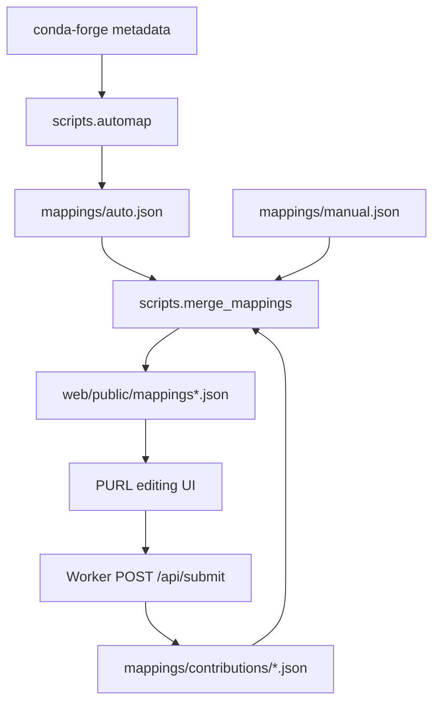
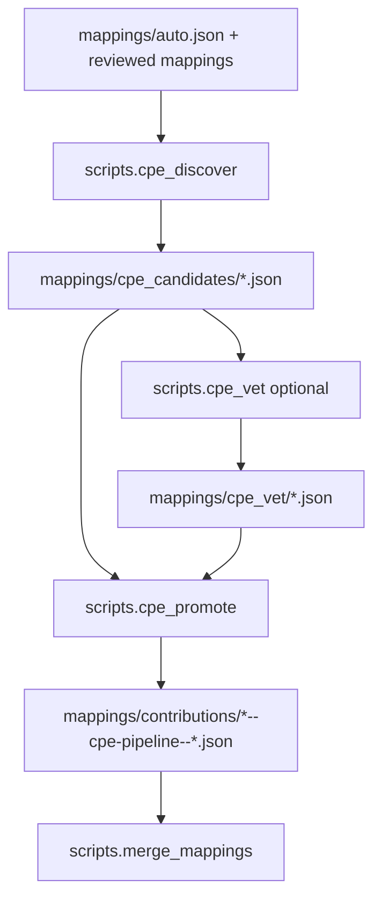

# PURL Associator

This repository maintains canonical **conda-forge package identity mappings**.
Each mapping record is keyed by conda-forge package name and carries identifiers
that downstream security tooling can use:

- a primary Package URL (**PURL**) and optional alternative PURLs
- optional CPE 2.3 vendor/product prefixes for NVD matching
- package context such as latest observed version, recipe/source URLs, summary,
  and download counts

CVE assignment, OpenVEX review state, AI CVE drafts, and SBOM-derived findings
are intentionally out of scope. A downstream CVE project should consume the
identity mapping payload produced here, enumerate conda-forge versions there,
and join those versions with OSV/NVD affected-version data there.

## Data model

The core object is a conda-forge package identity record:

```json
{
  "name": "ncurses",
  "version": "6.5",
  "purl": "pkg:github/ThomasDickey/ncurses-snapshots",
  "type": "github",
  "namespace": "ThomasDickey",
  "pkg_name": "ncurses-snapshots",
  "alternative_purls": [],
  "cpes": [
    "cpe:2.3:a:gnu:ncurses",
    "cpe:2.3:a:invisible-island:ncurses"
  ],
  "status": "verified"
}
```

PURLs identify source/package ecosystem coordinates. CPEs identify NVD
vendor/product coordinates. CPE strings stored here are identity-level prefixes;
this repository does not store CVE affected ranges or per-CVE version decisions.

## Sources and outputs

| Path | Purpose |
|---|---|
| `mappings/auto.json` | automatically inferred PURL mappings |
| `mappings/manual.json` | legacy/manual reviewed overrides |
| `mappings/contributions/*.json` | PR-submitted mapping contributions, including CPE pipeline output |
| `mappings/cpe_candidates/*.json` | audit output from CPE discovery |
| `mappings/cpe_vet/*.json` | optional AI tiebreaker output for ambiguous CPE candidates |
| `web/public/mappings.json` | generated full mapping bundle |
| `web/public/mappings-index.json` | generated compact index for the web app |
| `web/public/mapping_packages/*.json` | generated sharded package detail payloads |

## PURL flow



Useful commands:

```sh
pixi run purl:automap --only numpy,ripgrep,pandas
pixi run -e lite mappings:merge
pixi run -e lite mappings:validate
pixi run purl:test
```

## CPE flow

CPE discovery is part of identity mapping, not CVE assignment. The retained CPE
pipeline proposes NVD vendor/product prefixes and promotes accepted mappings as
normal contribution files. Those CPEs then flow through `scripts.merge_mappings`
into the public mapping payload.



Useful commands:

```sh
pixi run cpe:discover --top 50
pixi run cpe:vet --dry-run
pixi run cpe:promote --dry-run
pixi run -e lite mappings:merge
pixi run -e lite mappings:validate
```

## Frontend behavior

The GitHub Pages app is a PURL editing UI:

- users can review, edit, approve, or mark PURL mappings as unmapped
- staged PURL edits are saved locally until submitted
- submitted edits open PRs containing one new file under `mappings/contributions/`
- CPEs are displayed read-only as package identity metadata
- no CVE dashboard, OpenVEX review, AI CVE queue, or deep-inspection routes are
  served from this repository

The Worker exposes only:

- `POST /exchange` for GitHub OAuth code exchange
- `POST /api/submit` for PURL mapping contribution PRs

## Downstream CVE consumption

A downstream CVE project should consume `web/public/mappings.json` or the split
`mappings-index.json` + `mapping_packages/*.json` payload. It should then:

1. enumerate conda-forge package versions independently,
2. use PURLs for OSV/package-ecosystem matching,
3. use CPE prefixes for NVD matching,
4. apply OSV/NVD affected-version logic in that downstream project, and
5. store CVE assignment/review state outside this repository.

## Verification

Run these checks before opening a PR:

```sh
pixi run -e lite mappings:merge
pixi run -e lite mappings:validate
pixi run app:check
```

For frontend/Worker-only checks:

```sh
cd web && npm run build
cd worker && npm run typecheck
```
