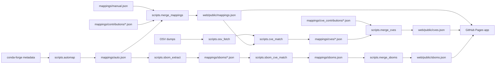
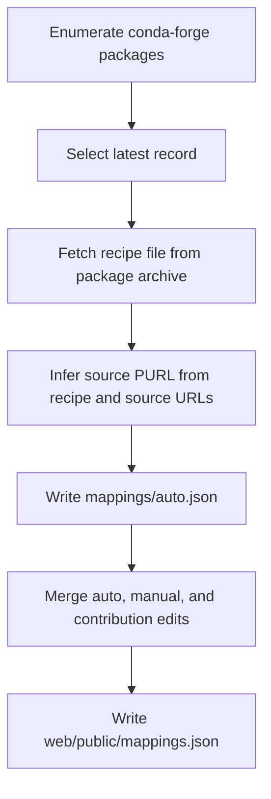
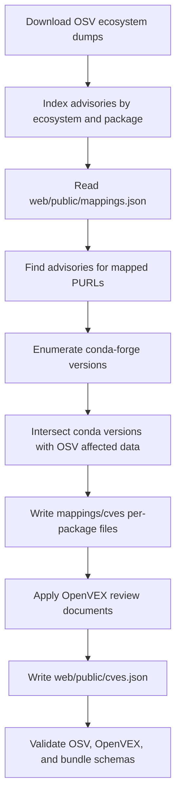
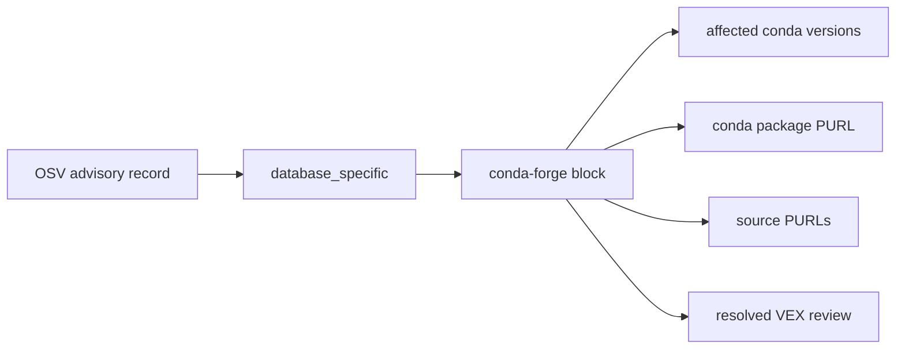
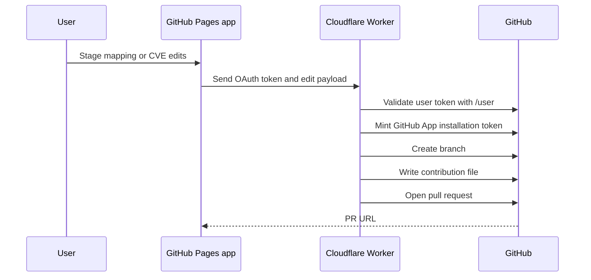
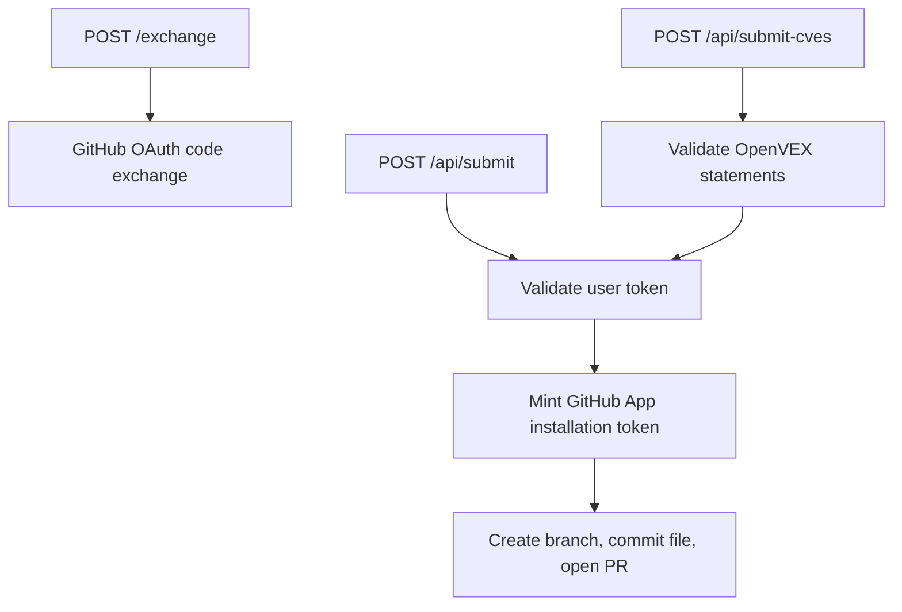
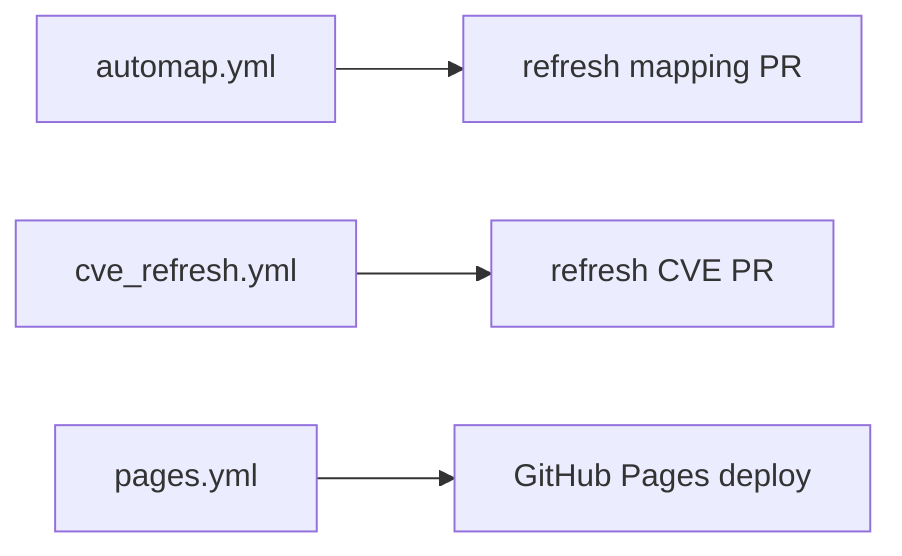
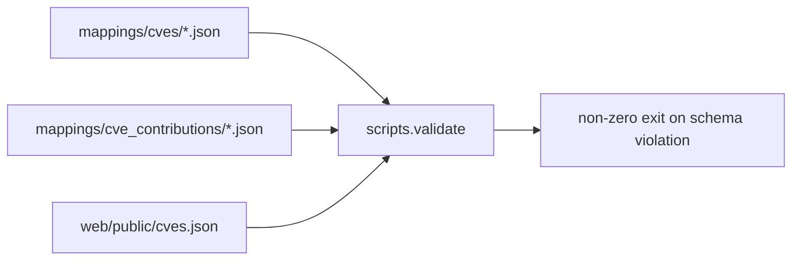

# PURL Associator

This repository maintains PURL mappings for conda-forge packages and uses
those mappings to derive CVE assignment data.

| Output | Produced by | Purpose |
|---|---|---|
| `web/public/mappings.json` | `scripts.merge_mappings` | Served package to PURL mapping data |
| `web/public/cves.json` | `scripts.merge_cves` | Served CVE dashboard data |
| `web/public/sboms.json` | `scripts.merge_sboms` | Served deep-inspection summary index |
| mapping PRs | Worker `POST /api/submit` | Human review of PURL mapping edits |
| CVE review PRs | Worker `POST /api/submit-cves` | Human review of OpenVEX CVE statements |

The web app is static. It reads generated JSON and submits edits to the
Cloudflare Worker. The Worker opens pull requests through a GitHub App
installation.

## Data Flow



## PURL Mapping Pipeline



`scripts.automap` uses `rattler.repo_data.Gateway` to enumerate package
records. It partially fetches recipe files from package archives, then
`scripts.purl_inference` decides the source PURL. For Python packages it also
checks the public Parselmouth conda-artifact-to-PyPI mapping by package sha256.
When Parselmouth artifact metadata agrees with an inferred PyPI PURL, the
mapping is marked `auto-verified` and does not need the normal human approval
step.

The inference step uses source URLs and recipe context. Recipe context matters
because source hosting is not always the package ecosystem. For example, a
Python package with a GitHub release tarball can still map to `pkg:pypi/<name>`
when the recipe builds a Python distribution.

Useful commands:

```sh
pixi run automap --only numpy,ripgrep,pandas
pixi run -e lite merge
```

Full refresh:

```sh
pixi run automap
pixi run -e lite merge
```

## CVE Pipeline



`scripts.cve_match` joins mapped PURLs to OSV advisories. It supports the OSV
ecosystems listed below.

| OSV ecosystem | PURL type |
|---|---|
| `PyPI` | `pkg:pypi` |
| `npm` | `pkg:npm` |
| `crates.io` | `pkg:cargo` |
| `RubyGems` | `pkg:gem` |
| `Maven` | `pkg:maven` |
| `Go` | `pkg:golang` |
| `CRAN` | `pkg:cran` |

Packages mapped only to other PURL types are skipped by this join. Common
examples are `pkg:github/...` and native packages that would need an NVD/CPE
bridge instead of an OSV package lookup.

Useful commands:

```sh
pixi run -e lite merge
pixi run cve-match --only numpy,requests,pillow
pixi run -e lite merge-cves
pixi run -e lite validate
```

## CVE Data Model

Per-package CVE files store OSV records with a conda-forge extension block:



The conda-forge data lives under:

```text
database_specific["conda-forge"]
```

The stored advisory remains OSV-shaped and is validated against the OSV schema.
The matcher removes malformed empty OSV range events when necessary so the
record validates.

Reviewer CVE contributions are OpenVEX 0.2.0 documents.

| Statement product | Meaning |
|---|---|
| `pkg:conda/<name>?channel=conda-forge` | package-level review for one advisory |
| `pkg:conda/<name>@<version>?channel=conda-forge` | version-specific override |

| VEX status | Effect in `merge_cves` |
|---|---|
| `affected` | package status, or add a version when version-pinned |
| `not_affected` | package status, or remove a version when version-pinned |
| `fixed` | package status, or remove a version when version-pinned |
| `under_investigation` | package status, or remove a version when version-pinned |

OpenVEX field requirements:

| Status | Required field |
|---|---|
| `affected` | `action_statement` |
| `not_affected` | `justification` or `impact_statement` |

The frontend generates these fields, the Worker validates submitted
statements, and `scripts.validate` validates committed documents.

## Standards

The repository uses existing security data formats instead of a custom CVE
review format.

| Standard | Used for | Why it is used |
|---|---|---|
| Package URL (PURL) | Package identity in mappings and conda products | Gives one package identifier format across PyPI, npm, crates, Maven, conda, and other ecosystems |
| OSV schema | Advisory records from OSV | Preserves the upstream advisory shape and allows validation with the published OSV schema |
| OpenVEX 0.2.0 | Human CVE review contributions | Represents whether a vulnerability affects a product, including `not_affected` justifications and `affected` actions |
| JSON Schema | Validation gates | Makes generated files and review contributions fail CI before bad data is published |

conda-forge is not an OSV ecosystem, so conda-specific match data is stored in
the OSV `database_specific["conda-forge"]` extension slot. That keeps the
advisory itself OSV-shaped while still recording the conda package, conda PURL,
matched source PURLs, and affected conda versions.

OpenVEX is used only for review input. The dashboard resolves OpenVEX
statements into the conda-forge block during `scripts.merge_cves`, so the
served `cves.json` contains both the OSV advisory and the current resolved
review state.

## Submission Flow



The user OAuth token identifies the submitter. Repository writes use the
GitHub App installation token minted by the Worker.

| Edit type | Endpoint | Branch prefix | Written file |
|---|---|---|---|
| PURL mapping | `POST /api/submit` | `purl-mapping/` | `mappings/contributions/*.json` |
| CVE review | `POST /api/submit-cves` | `cve-review/` | `mappings/cve_contributions/*.json` |

For CVE reviews, the browser sends OpenVEX statements. The Worker owns the
OpenVEX document envelope: document ID, author, timestamp, version, and
tooling.

## Worker



Worker routes:

| Route | Purpose |
|---|---|
| `POST /exchange` | Exchange a GitHub OAuth code for a user access token |
| `POST /api/submit` | Create a PURL mapping contribution PR |
| `POST /api/submit-cves` | Create an OpenVEX CVE review PR |

Worker configuration:

| Name | Secret | Purpose |
|---|---:|---|
| `GITHUB_CLIENT_ID` | no | GitHub App OAuth client ID |
| `GITHUB_CLIENT_SECRET` | yes | GitHub App OAuth client secret |
| `GITHUB_APP_ID` | no | GitHub App ID for JWT issuer fallback |
| `GITHUB_APP_PRIVATE_KEY` | yes | Private key used to sign GitHub App JWTs |
| `GITHUB_INSTALLATION_ID` | no | Installation that can write to this repo |
| `GITHUB_REPO_OWNER` | no | Repository owner |
| `GITHUB_REPO_NAME` | no | Repository name |
| `GITHUB_DEFAULT_BRANCH` | no | Pull request base branch |
| `GITHUB_CONTRIBUTIONS_DIR` | no | PURL contribution output directory |
| `GITHUB_CVE_CONTRIBUTIONS_DIR` | no | CVE contribution output directory |

Local Worker commands:

```sh
cd worker
npm install
npm run typecheck
npm run dev
```

Deploy with Wrangler:

```sh
cd worker
wrangler login
wrangler secret put GITHUB_CLIENT_SECRET
wrangler secret put GITHUB_APP_PRIVATE_KEY
wrangler deploy
```

## Web App

The web app has two entry points:

| Page | Purpose |
|---|---|
| `index.html` | edit PURL mappings |
| `cve.html` | review CVE assignments |

Local development:

```sh
cd web
npm install
npm run dev
```

The Pages build expects these repository variables:

| Variable | Purpose |
|---|---|
| `OAUTH_WORKER_URL` | deployed Worker URL |
| `OAUTH_CLIENT_ID` | GitHub App OAuth client ID |

Without these values, the app can load data but cannot submit pull requests.

## GitHub Actions



| Workflow | Trigger | Main steps |
|---|---|---|
| `automap.yml` | schedule and manual dispatch | run automap, merge mappings, open refresh PR |
| `cve_refresh.yml` | schedule and manual dispatch | match OSV advisories, merge OpenVEX reviews, validate, open refresh PR |
| `sbom_refresh.yml` | manual dispatch | refresh recipe-derived deep-inspection candidates across all conda-forge, extract embedded SBOMs, match transitive CVEs, open refresh PR |
| `pages.yml` | push to `main` and manual dispatch | regenerate served JSON, publish SBOM inspection index, validate, build Vite app, deploy Pages |

Worker deployment is done with Wrangler from `worker/`.

## Validation



Run the validation gate:

```sh
pixi run -e lite validate
```

Run Python linting:

```sh
pixi run -e dev lint
```

Run frontend checks:

```sh
cd web
npm run build
```

Run Worker type checks:

```sh
cd worker
npm run typecheck
```

## License

MIT
